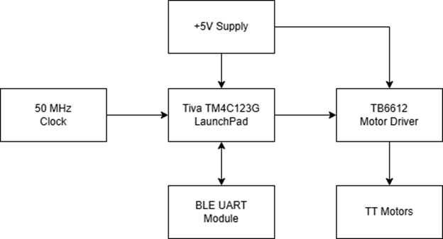

# Introduction

This project showcases the design of a remote-controlled (RC) vehicle using bluetooth low energy (BLE). The EK-TM4C123GXL microcontroller will be utilized to control all the hardware peripherals in this design. Wireless communication will be facilitated via the Bluefruit LE UART Friend module from Adafruit Industries. In addition to two TT motors, the Toshiba TB6612 will be utilized to receive command from the microcontroller and appropriately adjust the motors in terms of rotational speed and direction. 

# Results and Video Demonstration Links

- Demo: [Link](https://youtu.be/Ngg0JyMVhcI)

# Background and Methodology

This project utilizes embedded system concepts like C Programming, GPIO initialization, Signal Frequency and Pulse Width Modulation (PWM), and UART Communication. The expected outcome is to combine all these aspects of embedded systems to create an RC vehicle. 

The project goals were accomplished through a series of steps. The UART BLE module is supplied with +3.3V from the microcontroller and interfaces with PB0 and PB1 as the receive (RX) and transmit (TX) pins for communication. The transmitted string is captured into a buffer and  from there, a function is implemented to search the buffer for a specific string that was received and execute the proper code to control the motor driver based on if the received data corresponds to an up, down, left, or right on the control pad. The control pad also has a 1-4 number pad on the side which are uses to control the speed on the motors at 4 levels. Speed control for the motors is done with Generator 1 of PWM Module 1 (M1PWM2 and M1PWM3). Thus, PA6 and PA7 are configured as 15kHz PWM signals to control the speed of each motor with pins PWMA and PWMB on the TB6612 motor driver. For pins AIN1, AIN2, BIN1, and BIN2, pins PA2-PA5 are configured as GPIO to toggle between ‘1’ and ‘0’ appropriately to control the direction of the motors. VCC is connected to +3.3V from the microcontroller. VM is supplied 5V in parallel with the microcontroller.
In summary, the hardware/software peripherals used for this project are UART (U0RX, U0TX, U1RX, U1TX), PWM (M1PWM2 and M1PWM3), and GPIO (PA2-PA5).

# Functional Block Diagram

# Table of Components Used

| Description | Quantity | Manufacturer |
| --- | --- | --- |
| Tiva C Series TM4C123G LaunchPad | 1 | Texas Instruments |
| USB-A to Micro-USB Cable | 1 | N/A |
| Bluefruit LE UART Friend | 1 | Adafruit Industries |
| TB6612 Motor Driver | 1 | Toshiba |
| TT Motor | 2 | Adafruit Industries |
| 5V/2.4A Power Bank | 1 | EnergyQC |

# Table of Pinout Used

| +5V Supply | EK-TM4C123GXL | BLE UART Module | TB6612 Motor Driver | TT Motors |
| --- | --- | --- | --- | --- |
| - | PB0 | TXO | - | - |
| - | PB1 | RXI | - | - |
| - | +3.3V | VIN | VCC / STBY | - |
| GND | GND | CTS / MOD / GND | GND | - |
| +5V | MicroUSB | - | VM | - |
| - | PA2 | - | AIN1 | - |
| - | PA3 | - | AIN2 | - |
| - | PA4 | - | BIN1 | - |
| - | PA5 | - | BIN2 | - |
| - | PA6 | - | PWMA | - |
| - | PA7 | - | PWMB | - |
| - | - | - | AOUT1 | Motor A + |
| - | - | - | AOUT2 | Motor A - |
| - | - | - | BOUT1 | Motor B + |
| - | - | - | BOUT2 | Motor B - |